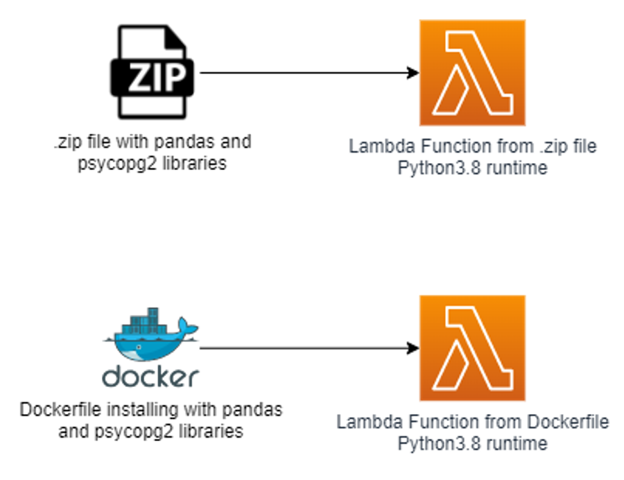
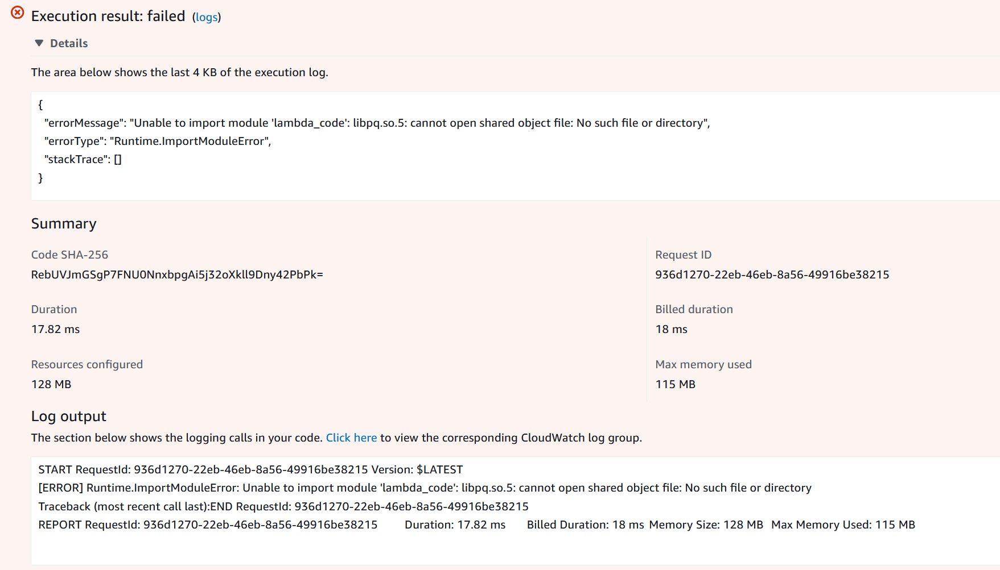
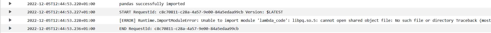
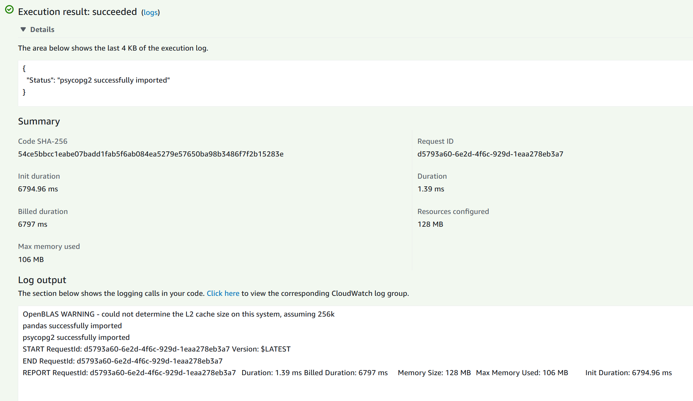

# Deploy AWS Step Functions that supports partial runs

[Psycopg](https://pypi.org/project/psycopg2/) is the most popular PostgresSQL database adapter for Python. It enables developers 
to write a Python application that interacts with a PostgreSQL database.

Among the compute options developers might want to include in their application, there is [AWS Lambda](https://aws.amazon.com/lambda/).
AWS Lambda is a serverless, event-driven compute service that lets developers run code for any type of application or
backend service without provisioning or managing servers. Lambda natively supports Python, Java, Go, PowerShell, Node.js, C#, and Ruby code, and provides a Runtime API 
allowing developers to use any additional programming languages to author functions.

By default, when you create a new function with a **Python runtime** (either version 3.9, 3.8, or 3.7), the Lambda 
execution environment is created from an [AWS-provided base image for Lambda](https://github.com/aws/aws-lambda-base-images).

When using Lambda, you will sooner or later need to use libraries, such as `pandas` or `psycopg2`, that are not included in the base image.
To this end, you need to bundle your libraries in a custom package, and attach it to Lambda.

There are multiple ways to do this, including:
* Deploying your Lambda function [from a .zip file archive](https://docs.aws.amazon.com/lambda/latest/dg/configuration-function-zip.html)
* Deploying your Lambda function [from a custom container image](https://docs.aws.amazon.com/lambda/latest/dg/gettingstarted-package.html#gettingstarted-package-images)
* Creating a [Lambda Layer](https://docs.aws.amazon.com/lambda/latest/dg/configuration-layers.html) and attaching it to your Lambda function

In this article, we focus on the **first two**.

With a **.zip deployment package**, adding the `pandas` library to your Lambda function is relatively straightforward. You just create a new folder in your
Linux machine, put the Lambda script together with the `pandas` library and its dependencies in the folder, zip it, and provide it as a source for your Lambda function.

However, **this same method does not work for `psycopg2`**. In this article, we illustrate the error that you will get when trying to use `psycopg2` in your Lambda function created from
a .zip deployment package, and we will see how to edit the Lambda image to make this work.

## Solution overview

To illustrate the challenges developers might face when using the `psycopg2` library in Lambda, we will deploy two Lambda functions:
* One Lambda function with the **Python3.8 runtime created from a .zip file**. The `psycopg2` and `libraries` are installed in this .zip deployment package with [pip](https://pypi.org/project/pip/).
* One Lambda function with the **Python3.8 runtime created from a Dockerfile**. The dockerfile installs the `psycopg2` and `pandas` libraries into the Lambda image.



With these two Lambda functions, we illustrate that installing the `pandas` library and its dependencies in a zip file is enough for your Lambda script to run.
This is however not the case for the `psycopg2` for reasons we will detail in [Run the Lambda function created from the .zip file](#zip). We then see that developers can overcome this limitation by creating their Lambda functions
from custom containers.

## Code deployment

#### Pre-requisites

For this deployment, you will need:
* An AWS account with sufficient permissions to deploy AWS resources packaged in this code.
* aws-cdk: installed globally (npm install -g aws-cdk) 
* git client
* python3.8

#### Clone the repository

Clone the GitHub repository on your machine:

```bash
git clone https://github.com/louishourcade/AWS-lambda-psycopg2.git
cd AWS-lambda-psycopg2
```

#### Configure your deployment

Edit the `app.py` file with information about your AWS account:

```python
aws_acccount = "AWS_ACCOUNT_ID"
region = "AWS_REGION"
```

This is the AWS environment where the resources will be deployed.

#### Bootstrap your AWS account

If not already done, you need to [bootstrap your AWS environment](https://docs.aws.amazon.com/cdk/v2/guide/bootstrapping.html) before deploying this CDK application.

Run the commands below with the AWS credentials of your AWS account:

```bash
cdk bootstrap aws://<tooling-account-id>/<aws-region>
```

#### Deploy the CDK application

Now that your AWS account is bootstrapped, and that you configured your deployment, you can deploy the CDK application with the following command:

```bash
cdk deploy AWSLambdaPyscopg2
```

Confirm the deployment in the terminal, wait until the CloudFormation stack is deployed, and you're done 🎉

## Run the Lambda functions

#### Explanations about the resources deployed

The AWS stack deploys 3 resources:
* An [IAM role](https://docs.aws.amazon.com/IAM/latest/UserGuide/id_roles.html) for the Lambda functions
* A Lambda function with a Python3.8 runtime, deployed from the `Constructs/lambda/lambda_deploy.zip` file
* A Lambda function with a Python3.8 runtime, deployed from the `Dockerfile` under the `Constructs` folder.

The script of both Lambda functions only checks that the `pandas` and `psycopg2` libraries are successfully imported:

```python
import pandas
print("pandas successfully imported")

import psycopg2
print("psycopg2 successfully imported")

def handler(event, context):
    """Function that checks whether psycopg2  and pandas are successfully imported or not"""
    return {"Status": "psycopg2 and pandas successfully imported"}
```

The `lambda_deploy.zip` is built with `Constructs/lambda/build.sh`. This bash script creates a folder, insert the Lambda script, install the 
`pandas` and `psycopg2` libraries, and generate the zip file. So if you want to generate the zip file yourself, just run this bash script.

The `Dockerfile` starts from the AWS-provided based image for Lambda with a python3.8 runtime. We then install `pandas` and `psycopg2` on top of this
default image.

#### Run the Lambda function created from the .zip file <a name="zip"></a>

On the AWS console, select the `lambda-from-zip` Lambda function, and create a test event to invoke it.

When invoked, it should raise an error:



When looking at the Cloudwatch logs, you can see that the `pandas` library has been imported successfully, but that is not the case
of the `psycopg2` library:



In summary, Lambda is able to use `pandas`, but not `psycopg2` **even though we packaged them similarly in the .zip file**.
This is error is actually due to Lambda missing the required PostgreSQL libraries in the default AMI image.
So if you want to use `psycopg2` within your Lambda function, either you edit the Lambda AMI (what we do in [Run the Lambda function created from the Dockerfile](#docker)), 
or you compile `psycopg2` with the PostgreSQL `lipq.so` library statically linked `libpq` library instead of the default dynamic link (more on this method [here](https://github.com/jkehler/awslambda-psycopg2))

#### Run the Lambda function created from the Dockerfile <a name="docker"></a>

On the AWS console, select the `lambda-from-docker` Lambda function, and create a test event to invoke it.

When invoked, it should run successfully:



Why does it work in this case ?

Instead of creating the Lambda function from a .zip file, we built it from the following Dockerfile:

```dockerfile
# Start from lambda Python3.8 image
FROM public.ecr.aws/lambda/python:3.8

# Copy the lambda code, together with its requirements
COPY lambda/requirements.txt ${LAMBDA_TASK_ROOT}
COPY lambda/lambda_code.py ${LAMBDA_TASK_ROOT}

# Install postgresql-devel in your image
RUN yum install -y gcc postgresql-devel

# install the requirements for the Lambda code
RUN pip3 install -r requirements.txt --target "${LAMBDA_TASK_ROOT}"

# Command can be overwritten by providing a different command in the template directly.
CMD ["lambda_code.handler"]
```

It takes the AWS-provided Lambda image for the python3.8 runtime, and install [postgresql-devel](https://yum-info.contradodigital.com/view-package/updates/postgresql-devel/)
which contains libraries needed to compile applications that directly interact with PostgreSQL management server. It also installs
`pandas` and `psycopg2` indicated in the `requirements.txt` file.

Creating a Lambda function from a Dockerfile thus enable developers to easily edit the image used by their Lambda functions,
and therefore use `psycopg2` in Lambda to interact with Postgres databases.

## Conclusion

This code sample illustrates how developers can use the `psycopg2` library within their Lambda functions to interact with their postgres database.

While this works with other python libraries such as `pandas`, adding the `psycopg2` library to a .zip Lambda deployment package is not enough because Lambda default AMI does not include the required PostgreSQL libraries.

However, developers can edit the Lambda image by defining their own Dockerfile. This notably enable developers to install all required PostgreSQL libraries
in the Lambda image, permitting the use of `psycopg2` in Lambda functions.

> :hammer: **Resources deletion**: By following this example, you deployed AWS resources in your account.
> You can remove them anytime by deleting the **AWSLambdaPyscopg2** Cloudformation stack from the Cloudformation console.


[](https://github.com/psf/black)
